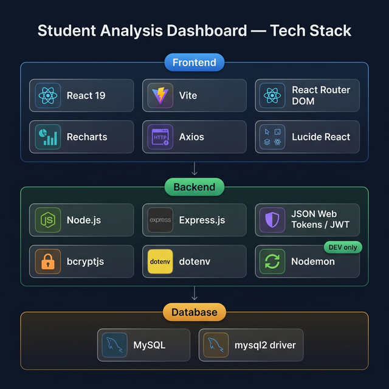
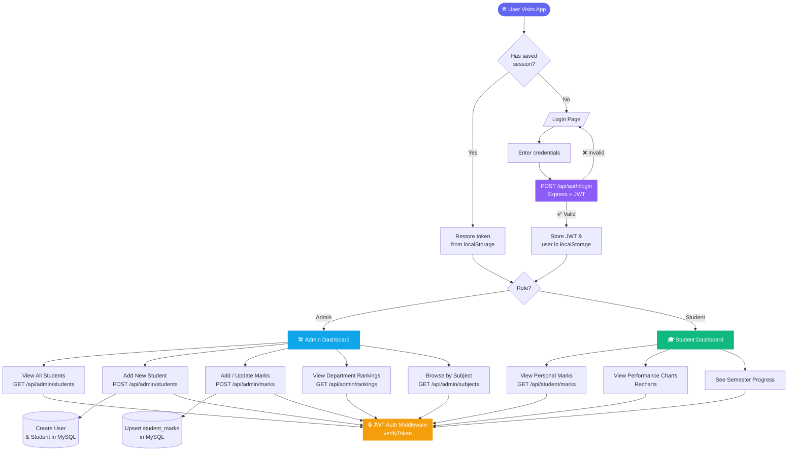

# 🎓 Student Analysis Dashboard

A full-stack web application for university administrators to monitor, analyze, and manage student academic performance across semesters and subjects.

---

## 🏗️ Tech Stack



| Layer | Technology | Purpose |
|-------|-----------|---------|
| **Frontend** | React 19 | UI component library |
| | Vite | Build tool & dev server |
| | React Router DOM | Client-side routing |
| | Recharts | Data visualization & charts |
| | Axios | HTTP client for API calls |
| | Lucide React | Icon library |
| **Backend** | Node.js | JavaScript runtime |
| | Express.js | Web framework & REST API |
| | JSON Web Tokens (JWT) | Authentication & authorization |
| | bcryptjs | Password hashing |
| | dotenv | Environment variable management |
| | Nodemon *(dev)* | Auto-restart during development |
| **Database** | MySQL | Relational database |
| | mysql2 | Node.js MySQL driver |

---

## � Application Flow



---

## �📁 Directory Layout

```
Miniproject2/
├── frontend/
│   ├── admin-panel/    # Admin dashboard (React + Vite)
│   └── student-panel/  # Student view (React + Vite)
└── backend/            # REST API (Node.js + Express)
    ├── config/         # DB & app configuration
    ├── controllers/    # Route handlers
    ├── middleware/     # Auth middleware
    ├── models/         # Database models
    └── routes/         # API route definitions
```

---

## 🚀 Getting Started

### Prerequisites
- Node.js v18+
- MySQL server running locally

### Backend

```bash
cd backend
npm install
# Copy .env.example to .env and fill in your credentials
cp .env.example .env
npm run dev
```

### Frontend (Admin Panel)

```bash
cd frontend/admin-panel
npm install
npm run dev
```

### Frontend (Student Panel)

```bash
cd frontend/student-panel
npm install
npm run dev
```
